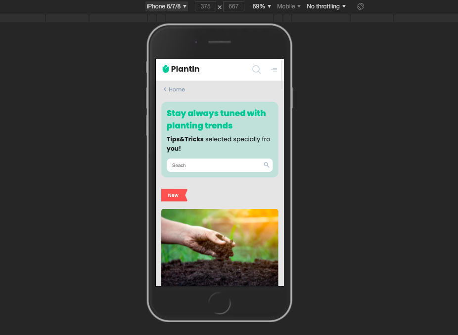

# PlantIn 
PlantIn is ReactJs SPA which implements layout with mobile-first approach, SCSS styles & BEM methodology.

### Preview



## How To Use

* Clone or download this repo to your desktop
* ``` cd my-app ```
* ``` npm install ``` to install its dependencies
* Once the dependencies are installed, you can run ```npm start``` to start the application
